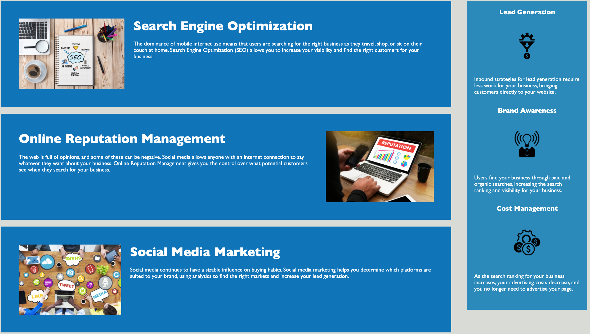

# Horiseon

## Purpose

A website for a Marketing Agency that offers services such as lead generation, seo optimization, and social media account management. The website will help prospective customers understand their services better.

## Table of Contents
- [Built With](#built-with)
- [Website](#website)
- [Installation](#installation)
- [Usage](#usage)
- [Contribution](#contribution)
- [License](#license)

## Built With

* HTML
* CSS

## Website

https://nsvoboda.github.io/marketing-agency-site/

## Getting Started

### Installation

It is best practice to directly clone the respository by using the following code in your Terminal/Command Line:

git clone git@github.com:nsvoboda/marketing-agency-site.git

### Usage

Learn about important concepts regarding search engine optimization and digital marketing. Reach out to ask about engaging Horiseon and their strategic services.

## Contribution
Edited with ❤️ by Nate and the Horiseon team.

## License

&copy; 2021 Nathaniel Svoboda

Licensed under the [BSD 2-Clause](LICENSE.txt)